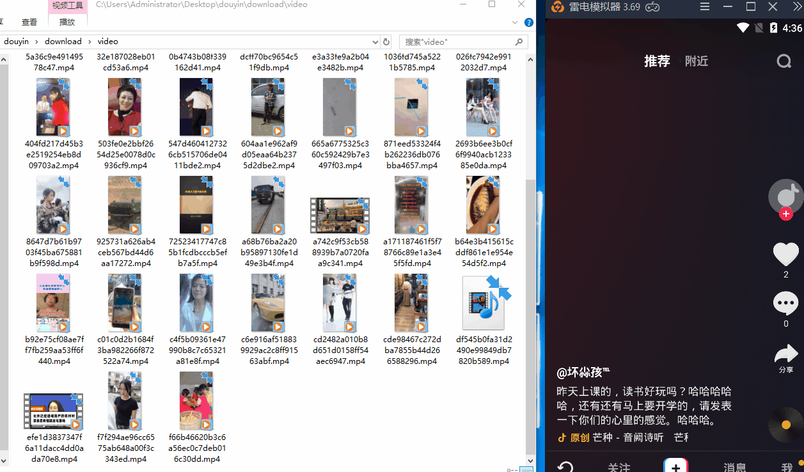

# 抖音推荐列表视频爬虫方案

基于APP爬取

技术栈：golang adb nodejs anyproxy

## 特点
- 可设置仅抓取大于xx赞的视频
- 可自定义设置是否下载远程文件到本地

## 使用

1 安装anyproxy,详细请自己google

2 使用android虚拟机或真机,安装抖音,配置anyproxy https代理

3 修改anyproxy配置文件,详见 angproxy目录下文件,具体看`beforeSendRequest` `beforeSendResponse` 函数代码

4 启动anyproxy(用pm2管理启动最佳)

5 复制 `config.example.toml` 为 `config.toml`,并根据自己需求修改参数

6 运行 本项目程序 
- 一起运行 `adb` 和 `web` 服务  :`go run main.go` 或 编辑运行也可
- 单独运行:`go run apps/adb/adb.go`和`go run apps/web/web.go`  或 编辑运行也可

7 若开启下载会生成一个 `database.db`的sqlite3数据库文件,字符详见`model/videos.go`文件,静态文件(用户头像,视频封面图,视频文件)将放在`download/[avatar,cover,video]`目录下

8 最后根据个人需要上传处理即可

## 待优化的地方

- 一直滑动请求推荐列表,APP会异常退出,所以暂时的方法是每爬取一段时间(配置文件里可自定义)后,强制关闭APP,重新打开继续爬取

- 目前个人在用的`雷电模拟器`,长时间运行会卡死,暂不清楚是系统原因还是模拟器原因,有测试能稳定运行环境的朋友,方便的话请告诉我,谢谢

## 最后说明

- 个人能力一般,有很多编码不规范的地方请包涵
- 有能力的朋友可以根据个人需求修改,如果可以请提交pr
- 如果使用有问题,请提交`issues` 或加我同名微信号,请备注github过来的,谢谢

## 捐赠

